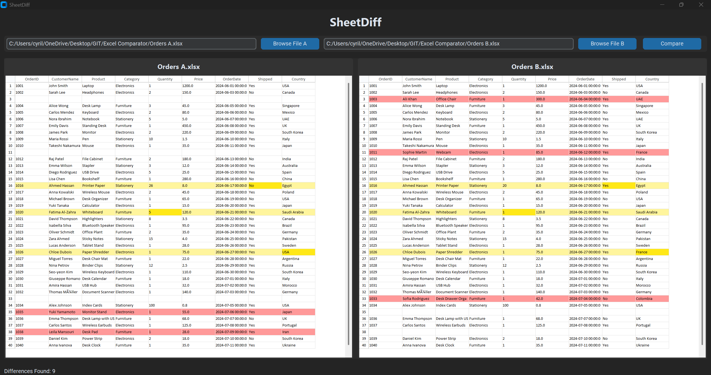

# SheetDiff

A modern desktop application for comparing Excel spreadsheets side-by-side.

SheetDiff helps users quickly identify added, deleted, and modified data through visual highlighting and exportable comparison reports.

## Features

- Side-by-side Excel comparison
- Detects added, deleted, and modified rows/cells
- Visual difference highlighting
- Key-column based matching
- Aligned row comparison
- Built with CustomTkinter and Pandas

## Installation

### Install Dependencies

```bash
pip install -r requirements.txt
```

### Run

```bash
python main.py
```

## Requirements

- Python 3.10+
- customtkinter
- pandas
- openpyxl
- tksheet

Install them using:

```bash
pip install -r requirements.txt
```

## Usage

1. Launch SheetDiff
2. Select File A and File B
3. Click Compare
4. Review highlighted differences

### Highlight Colors

| Color | Meaning |
|---------|---------|
| Yellow | Modified Cell |
| Light Yellow | Modified Row |
| Red | Added/Deleted Row |

## Screenshot



## Project Structure

```text
SheetDiff/
│
├── main.py
├── compare.py
├── requirements.txt
├── README.md
├── LICENSE
│
└── screenshots/
     └── sheetdiff_demo.png

```

## Technologies

- Python
- CustomTkinter
- Pandas
- OpenPyXL
- tksheet

## Roadmap

- Export File Differences
- Multiple worksheet comparison
- Synchronised scrolling
- Difference summary panel
- Search and filtering
- CSV support
- Editable comparison mode

## Contributing

Contributions, feature requests, and bug reports are welcome.

Feel free to open an issue or submit a pull request.

## License

MIT License

## Author

Developed by Cyril Capitulo.

If you find this project useful, please consider giving it a ⭐ on GitHub.
